# Master AV & Network Devices Inventory (with Optimization Notes + Signal Flow)
**The Audiopheliac – Complete AV, Gaming, and Network Inventory**  
Compiled: Updated October 2025  
Owner Device ID: GDMARCHE  

---

## 🎧 AUDIO COMPONENTS

### Turntables
- **Technics SL-1200MK2**
  - Location: Family Room
  - Connected to: Schiit Mani II → Yamaha R-N800A → Polk ES60 towers + SVS SB-1000 Pro sub
  - *Optimization Note:* Legacy DJ deck, but extremely stable and musical. Main reference rig.

- **Audio-Technica AT-LP120XUSB**
  - Location: Home Office
  - Connected to: ART DJPRE II → (split)
    - Path A: Bose 3•2•1 System
    - Path B: SVS Bluetooth Transmitter → Yamaha R-N800A (Line 2 input)
  - *Optimization Note:* Current split path + Bluetooth introduces lossy compression and added noise. Strong candidate for replacement with **WiiM Ultra** or phono stage with dual outs. Also needs better speakers than the Bose 3•2•1.

### Phono Preamps
- **Schiit Mani II** (Family Room)
- **ART DJPRE II** (Home Office)
  - *Optimization Note:* Splitting output to Bose + BT transmitter is a weak link.

### Amps & Monitoring
- **Yamaha R-N800A Network Receiver**
  - Reserved IP: `192.168.1.192` (MAC: 54:b7:bd:9f:ac:19)
  - *Connection Note:* Hardwired to SVS SB-1000 Pro sub. Line 2 input currently fed via SVS BT Receiver (linked to Office transmitter).
- **Positive Grid Spark 40** (guitar amp)
- **Sparknote Practice Amp** (office)
- **Audio-Technica ATH-M50x headphones**  
  - *Optimization Note:* Only headphones logged; add others if in rotation.

### Speakers
- **Polk Signature Elite ES60** (towers, Family Room)
- **Bose Lifestyle 650** (Family Room, IP: `192.168.1.102`)
- **Bose 3•2•1 Series II** (Home Office)
- **Bose SoundTouch I & II** (Location TBD)
  - *Optimization Note:* Log IPs when reserved.

### Subwoofers
- **SVS SB-1000 Pro**
  - Hardwired to Yamaha R-N800A
  - Packaged SVS BT Transmitter/Receiver pair is used separately for Office → Yamaha Line 2 link (not sub connection)

### Instruments
- **Seagull S Series SC-6W Acoustic Guitar**
- **Ibanez Performance PF5NT1201 Acoustic Guitar** (Serial: SQ00071493)
- **Casio Privia PX-870WE Digital Piano (White)**
  - Built-in speakers, USB/MIDI output
- **Main Electric Guitar** (TBD)
- **New Bee 2.4G Wireless Guitar System**

---

## 📺 VISUAL / DISPLAY SETUP

- **Samsung NU6950 65" UHD Smart TV** (Family Room, IP: `192.168.1.121`)
- **Vizio Smart TV** (Bedroom, IP: `192.168.1.154`)
- 2× Sansui HD Monitors, 2× Office HD Monitors

---

## 🎮 GAMING SYSTEMS
- **Sony PlayStation 5 (CFI-1015A)** (IP: `192.168.1.103`)
- **Xbox** (variant TBD – not One S)
- **Nintendo Switch (standard)**
- **Nintendo Switch Lite**

---

## 📡 NETWORKING & STORAGE

- **QNAP TS-473A NAS**
  - Drives: 2× WD Red Plus 10TB NAS HDD
  - Memory: Crucial DDR4 – upgraded to 32 GB installed
  - *Optimization Note:* Supports up to 64 GB RAM. Current setup solid.
- **QNAP 64:36:d5** (secondary NIC)
- **QNAP QSW-1105-5T** (2.5GbE unmanaged switch)
- **TP-Link Switches**: TL-SG105 / TL-SG108 / TL-SG116
- **Utilities**: Seagate SeaTools, DiscWizard

### Core Devices
- **PC – GDMARCHE** (primary workstation)
- **Work Laptop – VA (373-LT-42683)** (IP: `192.168.1.153`)

---

## 💻 WORKSTATION
- **Dell Precision 7540 (GDMARCHE)**
  - CPU: Intel Xeon E-2286M @ 2.40GHz
  - RAM: **112 GB DDR4 ECC** (confirmed)
  - GPU: NVIDIA Quadro RTX + Intel UHD P630
  - Storage: 1TB Samsung NVMe SSD
  - *Optimization Note:* RAM spec corrected; well above prior 64 GB.

---

## 🌐 SMART DEVICES & IOT

- **Qolsys IQ Panel** (IP: `192.168.1.78`)
- **Google Nest Cameras** (Lanai, Pool Entry, Hallway) – IP/MAC TBD
- **Google Nest Doorbell (Battery)** (IP: `192.168.1.69`)
- **Ring Spotlight Cam Pro** (Lanai)
- **Philips Hue Bridge** (IP: `192.168.1.165`)
- **WiZ Light** (IP: `192.168.1.139`)

### Smart Speakers & Streaming
- **Amazon Echo (Lanai)** (IP: `192.168.1.240`)
- **Google Chromecast** (IP: `192.168.1.82`)

---

## ⚡ OPTIMIZATION SUMMARY
- **Office vinyl chain** compromised by Bose + Bluetooth → candidate for WiiM Ultra + bookshelf speakers.
- **SoundTouch I & II**: add IPs for proper tracking.
- **Nest cameras**: reconcile TBD vs known IPs.
- **NAS**: now 2× 10TB drives + 32 GB RAM.
- **Precision 7540**: confirmed at 112 GB ECC RAM.

---

## 🎼 SIGNAL FLOW DIAGRAMS

### Family Room (Main Audiophile Rig)


### Home Office (Secondary / DJ Rig)

```mermaid
flowchart LR
    A[AT-LP120XUSB] --> B[ART DJPRE II]
    B --> C[Bose 3•2•1 System]
    B --> D[SVS BT Transmitter]
    D --> E[SVS BT Receiver]
    E --> F[Yamaha R-N800A Line 2]
```


### Guitar & Instrument Chain

```

