# Master AV & Network Devices Inventory (with Optimization Notes + Signal Flow)

**The Audiopheliac – Complete AV, Gaming, and Network Inventory**
Compiled: Updated October 2025
Owner Device ID: GDMARCHE

---

## 🎧 AUDIO COMPONENTS

### Turntables

* **Technics SL-1200MK2**

  * Location: Family Room
  * Serial: `GE4CQ71315`
  * Power: 120V, 60Hz, 14W
  * Connected to: Schiit Mani II → Yamaha R-N800A → Polk ES60 towers + SVS SB-1000 Pro sub
  * Cartridges: Ortofon Concorde Blue, Audio-Technica Gold/Red cart
  * *Optimization Note:* Legacy DJ deck, but extremely stable and musical. Main reference rig.

* **Audio-Technica AT-LP120XUSB (Bronze Edition)**

  * Location: Home Office
  * Cartridge: AT-VMN95E (black stylus)
  * Connected to: ART DJPRE II → (split)

    * Path A: Bose 3•2•1 System
    * Path B: SVS Bluetooth Transmitter → Yamaha R-N800A (Line 2 input)
  * Accessories: Pro-Ject Cork-It High-Quality Platter Mat
  * *Optimization Note:* The current split path + Bluetooth introduces lossy compression and noise. Candidate for **WiiM Ultra** or dual-output phono stage. Needs better speakers than the Bose 3•2•1.

* **Audio-Technica AT-LP120XUSB**

  * Location: Cameron's Room
  * (Standard model, cartridge TBD)

* **Victrola Integrated Turntable**

  * Location: Secondary space
  * All-in-one unit with built-in speakers.

### Phono Preamps

* **Schiit Mani II** (Family Room)
* **ART DJPRE II** (Home Office)

  * *Optimization Note:* Splitting output weakens fidelity.

### Amps & Monitoring

* **Yamaha R-N800A Network Receiver**

  * Reserved IP: `192.168.1.192`
  * MAC: `54:b7:bd:9f:ac:19`
  * Hardwired to SVS SB-1000 Pro sub
  * *Connection Note:* Line 2 fed via SVS BT Receiver.
* **Positive Grid Spark 40** (guitar amp)
* **Audio-Technica ATH-M50x headphones**
* **Beats Fit Pro**
* **Logitech H390 Wired Headset**

### Speakers

* **Polk Signature Elite ES60** (towers, Family Room)
* **Bose Lifestyle 650 Console**

  * Reserved IP: `192.168.1.102`
* **Bose 3•2•1 Series II** (Home Office)
* **Bose SoundTouch I & II** (portable, IPs TBD)
* **Bose SoundLink Revolve+ II** (portable Bluetooth)

### Subwoofers

* **SVS SB-1000 Pro** (Family Room, hardwired)
* **Bose Bass Module 700** (Bluetooth, paired with Lifestyle 650)

### Instruments

* **Seagull S Series SC-6W Acoustic Guitar**
* **Ibanez Performance PF5NT1201 Acoustic Guitar**

  * Serial: `SQ00071493`
* **Casio Privia PX-870WE Digital Piano (White)**

  * Built-in speakers, USB/MIDI output
* **Gibson Epiphone Les Paul Standard Pro – Sunburst**

### Accessories

* **SVS SoundPath Wireless Audio Adapter**

  * Receiver SN: `SPWR12240016`, Transmitter SN: `SPWT12240016`
* **New Bee 2.4G Wireless Guitar System**

---

## 📺 VISUAL / DISPLAY SETUP

* **Samsung NU6950 65" UHD Smart TV**

  * IP: `192.168.1.121`
* **Vizio Smart TV** (Bedroom)

  * IP: `192.168.1.154`
* **Sansui HD Monitors ×2**, **Office HD Monitors ×2**

---

## 🎮 GAMING SYSTEMS

* **Sony PlayStation 5 (CFI-1015A)**

  * IP: `192.168.1.103`
* **Xbox (variant TBD)**
* **Nintendo Switch (Standard)**
* **Nintendo Switch Lite**

---

## 📡 NETWORKING & STORAGE

### NAS & Switches

* **QNAP TS-473A NAS**

  * Reserved IP: `192.168.1.230`
  * MAC: `24:5e:be:87:82:8e`
  * Drives: 2× WD Red Plus 10TB NAS HDD
  * Memory: 32 GB DDR4 ECC (supports up to 64 GB)
  * *Optimization Note:* Solid for Plex + backups.
* **QNAP 64:36:d5** (secondary NIC)
* **QNAP QSW-1105-5T** (2.5GbE unmanaged switch)
* **TP-Link Switches**: TL-SG105 / TL-SG108 / TL-SG116

### Routers & Modems

* **Spectrum Router (Arcadyan)**

  * Reserved IP: `192.168.1.192`
  * Extender Pods: Bedroom + Laundry Room
* **Google Nest Mesh WiFi**

  * Two points (Office + Garage)
  * Linked via QNAP unmanaged switch
* **Cisco Valet Plus** (unused)
* **Spectrum Modem**

### Core Devices

* **PC – GDMARCHE (Primary Workstation)**
* **Work Laptop – VA (373-LT-42683)**

  * IP: `192.168.1.153`

---

## 💻 WORKSTATION

* **Dell Precision 7540 (GDMARCHE)**

  * CPU: Intel Xeon E-2286M @ 2.40GHz
  * RAM: **112 GB DDR4 ECC**
  * GPU: NVIDIA Quadro RTX + Intel UHD P630
  * Storage: 1TB Samsung NVMe SSD
  * BIOS Rev: 1.13.1
  * Service Tag: `14XB9Y2`
  * *Optimization Note:* RAM capacity far above average. Future GPU upgrade candidate.

---

## 🌐 SMART DEVICES & IOT

* **ADT Qolsys IQ Panel**

  * IP: `192.168.1.78`
* **Google Nest Cameras** (Lanai, Pool Entry, Hallway)

  * IPs: `192.168.1.82`, `192.168.1.185`
* **Google Nest Doorbell (Battery)**

  * IP: `192.168.1.69`
* **Amazon Ring Spotlight Cam Pro (Lanai)**

  * IP: `192.168.1.108`
* **Philips Hue Bridge**

  * IP: `192.168.1.165`
* **WiZ Light**

  * IP: `192.168.1.139`
* **MyQ Liftmaster Garage Door Opener**

  * S/N: `GW0F00339FA7`
  * Status: Unconfigured
* **Honeywell Home Proseries Thermostat**

  * Status: Unconfigured

### Smart Speakers & Streaming

* **Amazon Echo (Lanai)**

  * IP: `192.168.1.240`
* **Google Chromecast**

  * IP: `192.168.1.82`

---

## ⚡ OPTIMIZATION SUMMARY

* **Office vinyl chain** compromised by Bose + Bluetooth → candidate for WiiM Ultra + bookshelf speakers.
* **SoundTouch I & II**: reserve IPs for tracking.
* **Nest Cameras**: reconcile static IPs vs Spectrum dynamic list.
* **NAS**: 32 GB RAM, expandable to 64 GB.
* **Precision 7540**: confirmed 112 GB ECC RAM.

---

## 🎼 SIGNAL FLOW DIAGRAMS

### Family Room (Main Audiophile Rig)

### Home Office (Secondary / DJ Rig)

```mermaid
flowchart LR
    A[AT-LP120XUSB] --> B[ART DJPRE II]
    B --> C[Bose 3•2•1 System]
    B --> D[SVS BT Transmitter]
    D --> E[SVS BT Receiver]
    E --> F[Yamaha R-N800A Line 2]
```

### Guitar & Instrument Chain

