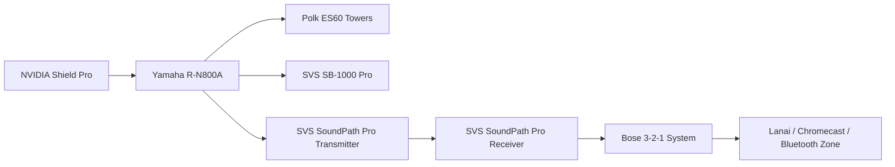

# 🎧 Master AV & Network Devices Inventory
**The Audiopheliac – Complete AV, Gaming, and Network Inventory**  
**Owner Device ID:** GDMARCHE  
**Last Updated:** October 2025  

---

## 🎛️ AUDIO COMPONENTS

### Turntables

* **Technics SL-1200MK2**
  * Location: Family Room  
  * Serial: `GE4CQ71315`  
  * Power: 120V, 60Hz, 14W  
  * Connected to: **Pro-Ject Phono Box S2 Ultra → Yamaha R-N800A → Polk ES60 towers + SVS SB-1000 Pro sub**  
  * Cartridge: **Ortofon Concorde Blue**  
  * *Optimization Note:* Vintage DJ deck, pristine condition, extremely stable and musical. Main reference rig.

* **Audio-Technica AT-LP120XUSB (Bronze Edition)**
  * Location: Home Office  
  * Serial: `243402497`  
  * Cartridge: Audio-Technica Gold/Red (Red currently mounted)  
  * Connected to: **Schiit Mani II → Schiit SYS Passive Preamp → JBL LSR310S 10" Powered Studio Subwoofer & HS7s**  
  * Accessories: Pro-Ject Cork-It High-Quality Platter Mat

* **Victrola Brighton – Bluetooth Record Player – 3-Speed Turntable**
  * Location: Cameron’s Room (getting the next generation into vinyl)  
  * Serial: `S240700587`  
  * Integrated stereo speakers with Bluetooth
  * *Optimization Note:* Standalone playback unit, independent from main system signal flow.

---

### Phono Preamps

* **Pro-Ject Phono Box S2 Ultra (Silver)** (Family Room)  
  * Serial: `25A001611`  
  * *Connection:* Technics SL-1200MK2 → Pro-Ject → Yamaha R-N800A  

* **Schiit Mani II** (Home Office)  
  * Serial: `CI182351284`  
  * *Connection:* AT-LP120XUSB → Manbi II  → SYS Passive Preamp → JBL LSR310S 10" Powered Studio Subwoofer & HS7s 
 
* **DJ PRE LE** (Unassigned)  
  * Entry-level, decent-quality phonopreamp for a budget  
  * *Optimization Note:* May be used in the garage-gym space with Victrola.

---

### Amplifiers & Monitoring

* **Yamaha R-N800A Network Receiver**  
  * Reserved IP: `192.168.1.192`  
  * MAC: `54:b7:bd:9f:ac:19`  
  * Pre-Out → SVS SoundPath Wireless Pro Transmitter  
  * Hardwired to SVS SB-1000 Pro sub  

* **Positive Grid Spark 40** (Guitar Amp) - Serial: `S040C624565`
* **Audio-Technica ATH-M50x Headphones**  
* **Beats Fit Pro**  
* **Logitech H390 Wired Headset**  

* **Schiit SYS Passive Preamp + 2-Input Switch (Black)**  
  * *Use:* Volume control and source switch for JBL Subwoofer and Yamaha HS7 pair  
  * *Placement:* Desktop (Home Office signal hub)  
  * *Note:* Pure passive design, ideal for transparent attenuation and quick A/B between sources.

* **AIRHub (USB Audio Interface / DAC Hub)**  
  * Serial: `21A31909244300030`  
  * *Role:* USB DAC + Headphone hub for desktop monitoring  
  * *Connection:* USB-C → Dell Precision / MacBook Pro (as required)  
  * *Optimization Note:* Recommended as interface for nearfield HS7 chain; offloads DAC duties from system.

---

### Speakers

* **Polk Signature Elite ES60** (Towers – Family Room)  
* **Bose Lifestyle 650 Console** – Reserved IP: `192.168.1.102`  
* **Bose 3-2-1 Series II** (Home Office) – Connected via SVS SoundPath Wireless Pro Receiver  
* **Bose SoundLink Revolve+ II** (Portable Bluetooth)  
* **Yamaha HS7 6.5" Powered Studio Monitors (Pair – Black)**  
  * Location: Home Office  
  * Serial Numbers: `UFWM02219`, `UFWM02220`  
  * Power: 60W LF / 35W HF bi-amp (95W total per speaker)  
  * Input: XLR/TRS balanced  
  * *Connection:* Via **Schiit SYS Passive Preamp** → Dell Precision (monitoring chain)  
  * *Optimization Note:* Studio-reference neutrality with exceptional imaging; placement isolation pads recommended.

---

### Subwoofers

* **SVS SB-1000 Pro** (Family Room – Hardwired)
* **JBL LSR310S 10" Powered Studio Subwoofer** (office - paired with HS7s via SYS Switch and AIR Hub)
* **Bose Bass Module 700** (Bluetooth – Paired with Lifestyle 650)

---

### Instruments

* **Seagull S Series SC-6W Acoustic Guitar (2002 La Patrie QC)** - Serial: `02286309`  
* **Ibanez Performance PF5NT1201 Acoustic Guitar** – Serial: `SQ00071493`  
* **Casio Privia PX-870WE Digital Piano (White)** – Built-in Speakers, USB/MIDI Output; Serial: `941BDC31K047200ADD`  
* **Gibson Epiphone Les Paul Standard Pro – Sunburst** – Serial: `1205201591`  

---

### Accessories

* **SVS SoundPath Wireless Audio Adapter (Pro)**  
  * **Transmitter SN:** SPWT12240016 — connected to Yamaha R-N800A Pre-Out  
  * **Receiver SN:** SPWR12240016 — connected to Bose 3-2-1 TV Input (Home Office)  
  * *Optimization Note:* Enables whole-home analog audio streaming from Yamaha to remote zones.

* **New Bee 2.4G Wireless Guitar System**  

---

## 📺 VISUAL / DISPLAY SETUP

* **Samsung NU6950 65" UHD Smart TV** – IP: `192.168.1.121`  
* **Vizio Smart TV** (Bedroom) – IP: `192.168.1.154`  
* **Sansui HD Monitors ×2**  
* **Office HD Monitors (Dell) ×2**  
* **USB-C Triple Display Docking Station - Model: JCD543**
---

## 🎮 GAMING SYSTEMS

* **Sony PlayStation 5 (CFI-1015A)** – IP: `192.168.1.103`  
* **Xbox One**  
* **Nintendo Switch (Standard)**  
* **Nintendo Switch Lite**  

---

## 📡 NETWORKING & STORAGE

### NAS & Switches

* **QNAP TS-473A NAS**  
  * Reserved IP: `192.168.1.230`  
  * MAC: `24:5e:be:87:82:8e`  
  * Drives: 2× WD Red Plus 10TB NAS HDD  
  * Memory: 32 GB DDR4 ECC (Expandable to 64 GB)  
  * *Optimization Note:* Excellent for Plex, backups, and LAN caching.

* **QNAP QSW-1105-5T** (2.5GbE Unmanaged Switch)  
* **TP-Link 5Gb Switch** – LAN aggregation hub for Google Nest  

---

### Routers & Modems

* **Spectrum Router (SAX2V1R – WiFi 6E)**  
  * IP: `192.168.1.1`  
  * Extenders: Bedroom + Laundry  
  * *SSID:* “FBI Surveillance”  

* **Spectrum Modem (EN2251 – DOCSIS 3.1)**  
  * Serial: `B522251F0152`  
  * Status: Active – Bridge disabled  

* **Google Nest Mesh WiFi System**  
  * Main Point (family room) – IP: `192.168.1.239` / MAC: `1c:53:f9:26:e2:fd`  
  * Secondary Point (Garage) – IP: `192.168.1.174` / MAC: `b0:e4:d5:3a:78:fd`  
  * Extension Point – (office) IP: `192.168.1.90` / MAC: `b8:7b:d4:cf:ee:7b`  
  * *LAN Output → TP-Link 5Gb Switch*  
  * *DNS:* Cloudflare (1.1.1.1 / 1.0.0.1)  

* **Network Flow**  
```
[Spectrum Modem EN2251]  
   ↓  
[Spectrum Router SAX2V1R]  
   │
   ├─→ Google Nest Mesh (WAN Port)
   │        │
   │        └─→ LAN → TP-Link 5Gb Switch → Wired Clients
   │
   └─→ Spectrum Extenders (Bedroom + Laundry)
```

---

### Reserved IP Assignments
(Imported from Reserved_IPs.txt)

| **Device**              | **Reserved IP**   | **Notes**                     |
|--------------------------|------------------|--------------------------------|
| Yamaha R-N800A           | `192.168.1.192`  | Primary receiver              |
| QNAP NAS                 | `192.168.1.230`  | Static storage server         |
| Dell Precision 7540      | `192.168.1.75`   | Workstation *(GDMARCHE)*      |
| PlayStation 5            | `192.168.1.103`  | Gaming console                |
| Bose Lifestyle 650       | `192.168.1.102`  | Main theater system           |
| Samsung TV               | `192.168.1.121`  | Family Room display           |
| Vizio TV                 | `192.168.1.154`  | Bedroom                       |
| Google Nest Router       | `192.168.1.239`  | Primary mesh point            |
| Nest Node (Garage)       | `192.168.1.174`  | Secondary node                |
| Nest Node (Ext.)         | `192.168.1.90`   | Extended coverage             |
| Amazon Echo (Lanai)      | `192.168.1.240`  | Smart speaker                 |
| ADT Qolsys Panel         | `192.168.1.78`   | Security hub                  |
| Philips Hue Bridge       | `192.168.1.165`  | Lighting control              |
| NVIDIA Shield Pro        | `192.168.1.250`  | Streaming hub                 |
| MyQ Garage Door          | *Dynamic*        | Unconfigured                  |
| Honeywell Thermostat     | *Dynamic*        | Unconfigured                  |

---

## 💻 WORKSTATION

* **Dell Precision 7540 (GDMARCHE)**
  * Serial: `C17J10PDDTY3`  
  * CPU: Intel Xeon E-2286M @ 2.40GHz
  * *Purpose:* Personal and Veteran Analytics
  * RAM: 112 GB DDR4 ECC  
  * GPU: NVIDIA Quadro RTX + Intel UHD P630  
  * Storage: 1TB Samsung NVMe SSD + **Samsung 990 PRO 2TB NVMe**  
  * BIOS Rev: 1.13.1  
  * Service Tag: `14XB9Y2`  
  * *Optimization Note:*
    * SSD upgrade installation and Windows OS swap successful, 10/07/25.
    * Upgrade to full RAM capacity pending. 
 
* **Dell Latitude 5340 (373-LT-4683)**
  * Serial: `H67LKY3`  
  * CPU: Intel vPRO i7
  * *Purpose:* Official Department of Veterans Affairs business
  * RAM:
  * GPU:
  * Storage:
  * BIOS:
  * VA Inventory Tag: `608 EE42683` 

* **Apple MacBook Pro (13-inch, Mid 2012)**  
  * Serial: `C17J10PDDTY3`  
  * *Purpose:* Kids’ School / General Use Laptop  
  * Upgrades:  
    - **SSD:** Samsung 870 EVO 1 TB (MZ-77E1T0B/AM)  
    - **Battery:** iFixit A1322 Replacement  
    - **Memory:** Crucial 16 GB (2×8 GB DDR3 PC3-12800, 204-pin SODIMM)  
  * *Status:* Recommissioned and optimized for school workflows.  
  * *OS:* macOS Catalina (verified clean install)  
  * *Note:* Post-upgrade thermal checks passed; reliable secondary system.  

---

## 🌐 SMART DEVICES & IOT

* **ADT Qolsys IQ Panel** – IP: `192.168.1.78`  
* **Google Nest Cameras** – Lanai: `192.168.1.82`, Pool Entry: `192.168.1.185`, Hallway: dynamic  
* **Google Nest Doorbell (Battery)** – IP: `192.168.1.69`  
* **Amazon Ring Spotlight Cam Pro (Lanai)** – IP: `192.168.1.108`  
* **Philips Hue Bridge** – IP: `192.168.1.165`  
* **WiZ Light** – IP: `192.168.1.139`  
* **MyQ Liftmaster Garage Door Opener** – S/N: `GW0F00339FA7`, Status: Unconfigured  
* **Honeywell Home Proseries Thermostat** – Status: Unconfigured  

---

### Smart Speakers & Streaming

* **Amazon Echo (Lanai)** – IP: `192.168.1.240`  
* **Google Chromecast** – IP: `192.168.1.82`  

---

## ⚡ OPTIMIZATION SUMMARY

* **Whole-Home Audio:** Yamaha → SVS SoundPath → external inputs when SVS receiver is connected.  
* **Office Vinyl Chain:** AT-LP120XUSB → Schiit Mani II → Schiit SYS Passive Preamp → JBL LSR310S 10" Powered Studio Subwoofer & HS7s 
* **Office Studio Chain:** Dell Precision → AIRHub → Schiit SYS → JBL LSR310S 10" Powered Studio Subwoofer & Yamaha HS7 Monitors.  
* **Google Mesh:** LAN backhaul added to switch for Google Home stability.  
* **Cloudflare DNS:** Verified active on Nest Mesh.  
* **Spectrum Router:** Maintains SSID “FBI Surveillance” with extenders active.  
* **Dell Precision:** Upgraded storage verified (Samsung 990 PRO).  

---

## 🎼 SIGNAL FLOW DIAGRAMS

### Whole-Home Audio Flow (Family Room → Office → Lanai)


